# Graph Matrix (Mermaid)


This test creates a matrix of all possible combinations of before/after agent and before/after model jump targets for two middleware instances.
The basic test setup is as follows:

```ts
const middleware1 = createMiddleware({
    name: "MiddlewareA",
    beforeAgent: {
        hook: () => {},
        canJumpTo: aBeforeAgent,
    },
    afterAgent: {
        hook: () => {},
        canJumpTo: aAfterAgent,
    },
    beforeModel: {
        hook: () => {},
        canJumpTo: aBefore,
    },
    afterModel: {
        hook: () => {},
        canJumpTo: aAfter,
    },
});

const middleware2 = createMiddleware({
    name: "MiddlewareB",
    beforeAgent: {
        hook: () => {},
        canJumpTo: bBeforeAgent,
    },
    afterAgent: {
        hook: () => {},
        canJumpTo: bAfterAgent,
    },
    beforeModel: {
        hook: () => {},
        canJumpTo: bBefore,
    },
    afterModel: {
        hook: () => {},
        canJumpTo: bAfter,
    },
});

const agent = createAgent({
    model: "openai:gpt-4o-mini",
    tools: [someTool],
    middleware: [middleware1, middleware2],
});
```

<details>
<summary>

MiddlewareA beforeAgent: undefined<br/>
MiddlewareA afterAgent: undefined<br/>
MiddlewareA before: undefined<br/>
MiddlewareA after: undefined<br/>
MiddlewareB beforeAgent: undefined<br/>
MiddlewareB afterAgent: undefined<br/>
MiddlewareB before: undefined<br/>
MiddlewareB after: undefined<br/>
Tools: <code>no</code>

</summary>

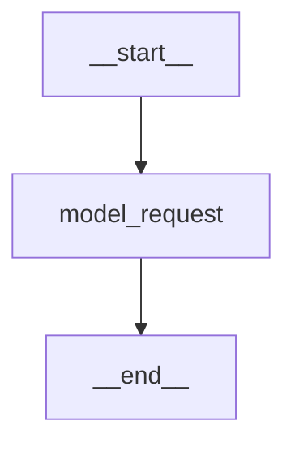

</details>

<details>
<summary>

MiddlewareA beforeAgent: undefined<br/>
MiddlewareA afterAgent: undefined<br/>
MiddlewareA before: empty<br/>
MiddlewareA after: empty<br/>
MiddlewareB beforeAgent: undefined<br/>
MiddlewareB afterAgent: undefined<br/>
MiddlewareB before: empty<br/>
MiddlewareB after: empty<br/>
Tools: <code>no</code>

</summary>

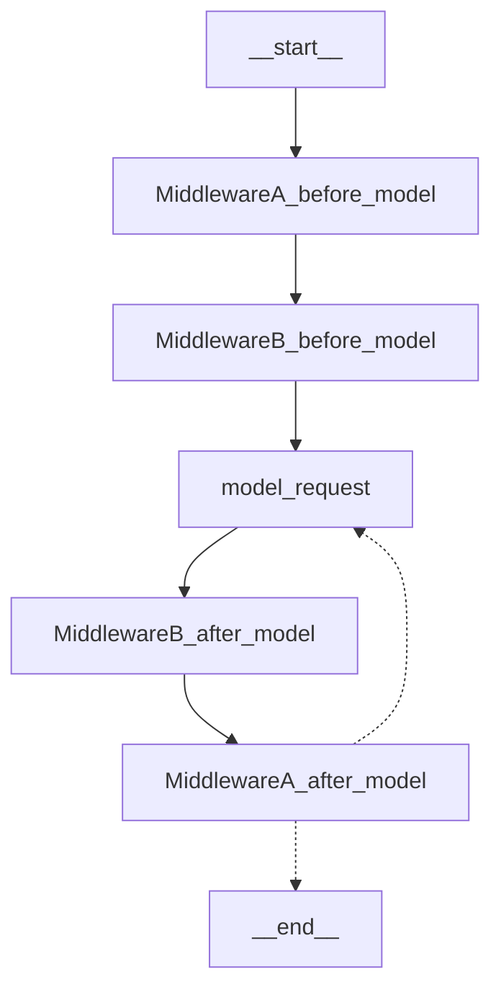

</details>

<details>
<summary>

MiddlewareA beforeAgent: undefined<br/>
MiddlewareA afterAgent: undefined<br/>
MiddlewareA before: <code>tools</code><br/>
MiddlewareA after: undefined<br/>
MiddlewareB beforeAgent: undefined<br/>
MiddlewareB afterAgent: undefined<br/>
MiddlewareB before: undefined<br/>
MiddlewareB after: undefined<br/>
Tools: <code>no</code>

</summary>

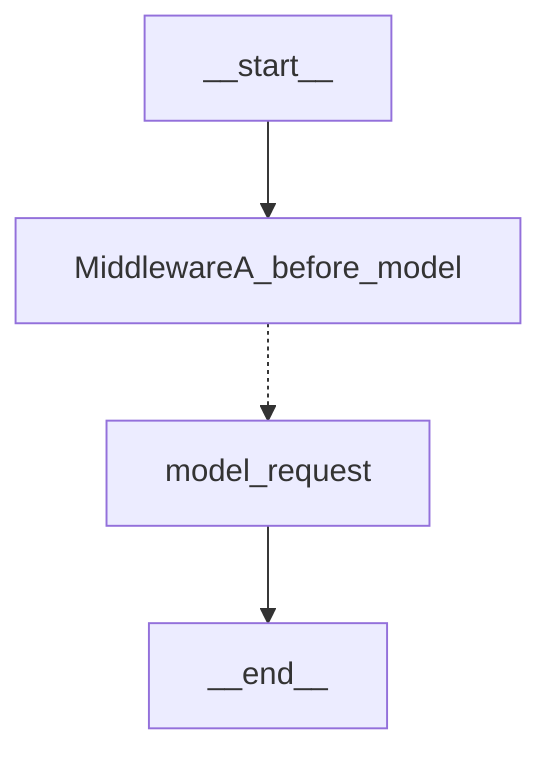

</details>

<details>
<summary>

MiddlewareA beforeAgent: undefined<br/>
MiddlewareA afterAgent: undefined<br/>
MiddlewareA before: undefined<br/>
MiddlewareA after: <code>tools</code><br/>
MiddlewareB beforeAgent: undefined<br/>
MiddlewareB afterAgent: undefined<br/>
MiddlewareB before: undefined<br/>
MiddlewareB after: undefined<br/>
Tools: <code>no</code>

</summary>

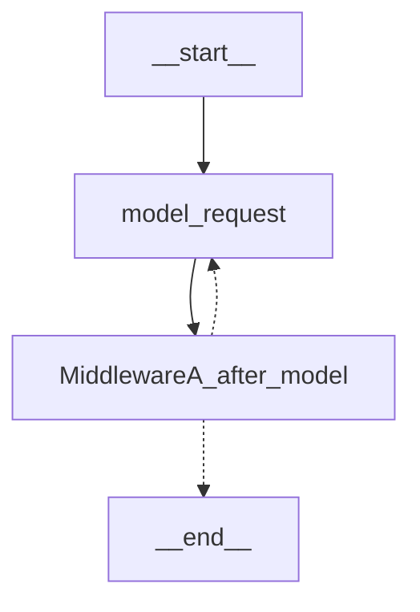

</details>

<details>
<summary>

MiddlewareA beforeAgent: undefined<br/>
MiddlewareA afterAgent: undefined<br/>
MiddlewareA before: <code>model</code><br/>
MiddlewareA after: undefined<br/>
MiddlewareB beforeAgent: undefined<br/>
MiddlewareB afterAgent: undefined<br/>
MiddlewareB before: undefined<br/>
MiddlewareB after: undefined<br/>
Tools: <code>no</code>

</summary>


</details>

<details>
<summary>

MiddlewareA beforeAgent: undefined<br/>
MiddlewareA afterAgent: undefined<br/>
MiddlewareA before: undefined<br/>
MiddlewareA after: <code>model</code><br/>
MiddlewareB beforeAgent: undefined<br/>
MiddlewareB afterAgent: undefined<br/>
MiddlewareB before: undefined<br/>
MiddlewareB after: undefined<br/>
Tools: <code>no</code>

</summary>


</details>

<details>
<summary>

MiddlewareA beforeAgent: undefined<br/>
MiddlewareA afterAgent: undefined<br/>
MiddlewareA before: <code>end</code><br/>
MiddlewareA after: undefined<br/>
MiddlewareB beforeAgent: undefined<br/>
MiddlewareB afterAgent: undefined<br/>
MiddlewareB before: undefined<br/>
MiddlewareB after: undefined<br/>
Tools: <code>no</code>

</summary>

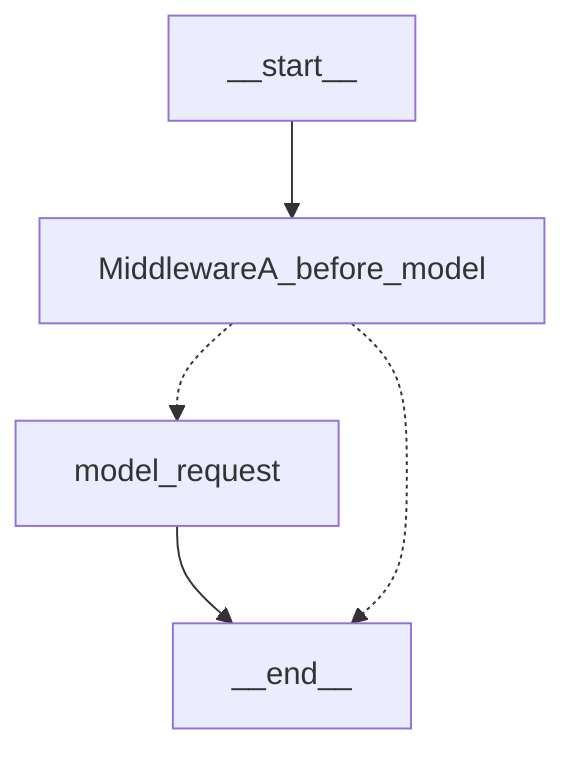

</details>

<details>
<summary>

MiddlewareA beforeAgent: undefined<br/>
MiddlewareA afterAgent: undefined<br/>
MiddlewareA before: undefined<br/>
MiddlewareA after: <code>end</code><br/>
MiddlewareB beforeAgent: undefined<br/>
MiddlewareB afterAgent: undefined<br/>
MiddlewareB before: undefined<br/>
MiddlewareB after: undefined<br/>
Tools: <code>no</code>

</summary>


</details>

<details>
<summary>

MiddlewareA beforeAgent: undefined<br/>
MiddlewareA afterAgent: undefined<br/>
MiddlewareA before: <code>tools</code><br/>
MiddlewareA after: undefined<br/>
MiddlewareB beforeAgent: undefined<br/>
MiddlewareB afterAgent: undefined<br/>
MiddlewareB before: <code>model</code><br/>
MiddlewareB after: undefined<br/>
Tools: <code>no</code>

</summary>

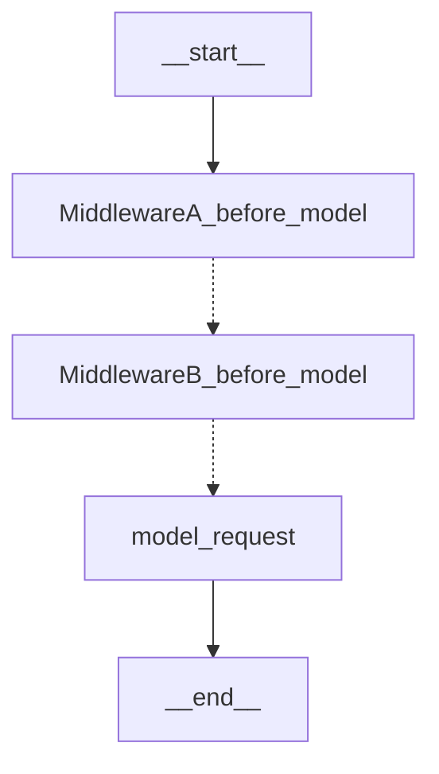

</details>

<details>
<summary>

MiddlewareA beforeAgent: undefined<br/>
MiddlewareA afterAgent: undefined<br/>
MiddlewareA before: <code>model</code><br/>
MiddlewareA after: undefined<br/>
MiddlewareB beforeAgent: undefined<br/>
MiddlewareB afterAgent: undefined<br/>
MiddlewareB before: <code>tools</code><br/>
MiddlewareB after: undefined<br/>
Tools: <code>no</code>

</summary>

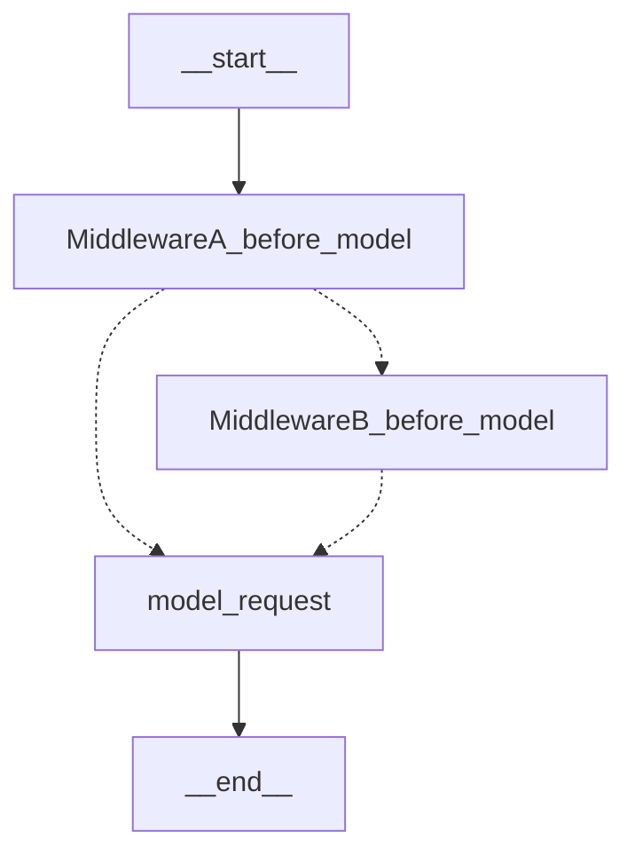

</details>

<details>
<summary>

MiddlewareA beforeAgent: undefined<br/>
MiddlewareA afterAgent: undefined<br/>
MiddlewareA before: undefined<br/>
MiddlewareA after: <code>tools</code><br/>
MiddlewareB beforeAgent: undefined<br/>
MiddlewareB afterAgent: undefined<br/>
MiddlewareB before: undefined<br/>
MiddlewareB after: <code>model</code><br/>
Tools: <code>no</code>

</summary>

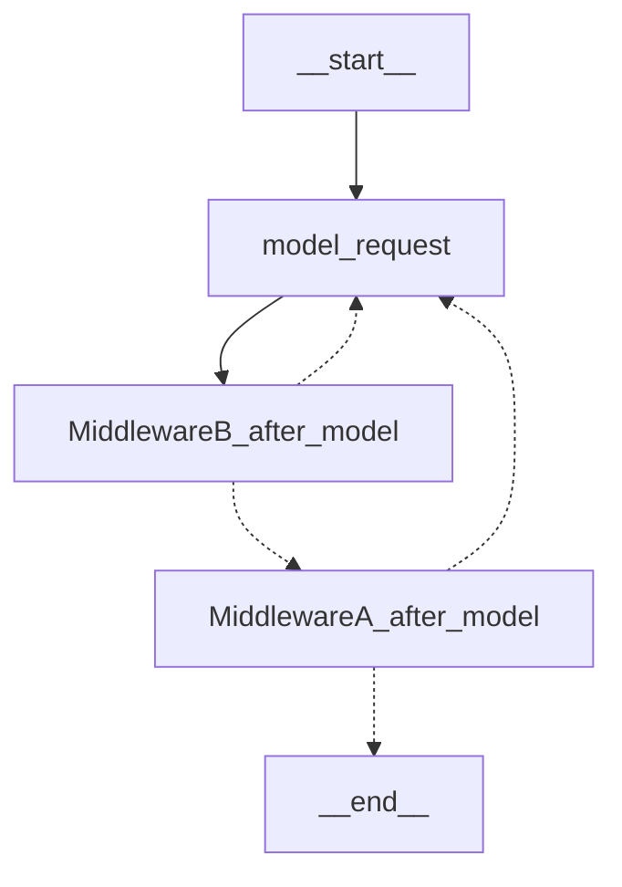

</details>

<details>
<summary>

MiddlewareA beforeAgent: undefined<br/>
MiddlewareA afterAgent: undefined<br/>
MiddlewareA before: undefined<br/>
MiddlewareA after: <code>model</code><br/>
MiddlewareB beforeAgent: undefined<br/>
MiddlewareB afterAgent: undefined<br/>
MiddlewareB before: undefined<br/>
MiddlewareB after: <code>tools</code><br/>
Tools: <code>no</code>

</summary>

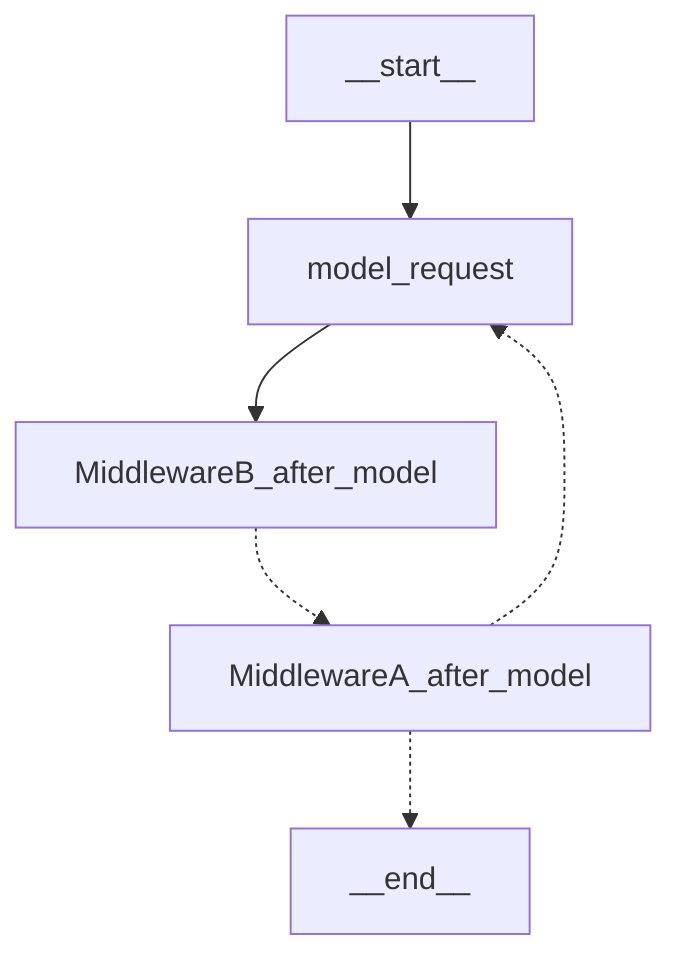

</details>

<details>
<summary>

MiddlewareA beforeAgent: undefined<br/>
MiddlewareA afterAgent: undefined<br/>
MiddlewareA before: <code>tools</code><br/>
MiddlewareA after: <code>model</code><br/>
MiddlewareB beforeAgent: undefined<br/>
MiddlewareB afterAgent: undefined<br/>
MiddlewareB before: undefined<br/>
MiddlewareB after: undefined<br/>
Tools: <code>no</code>

</summary>

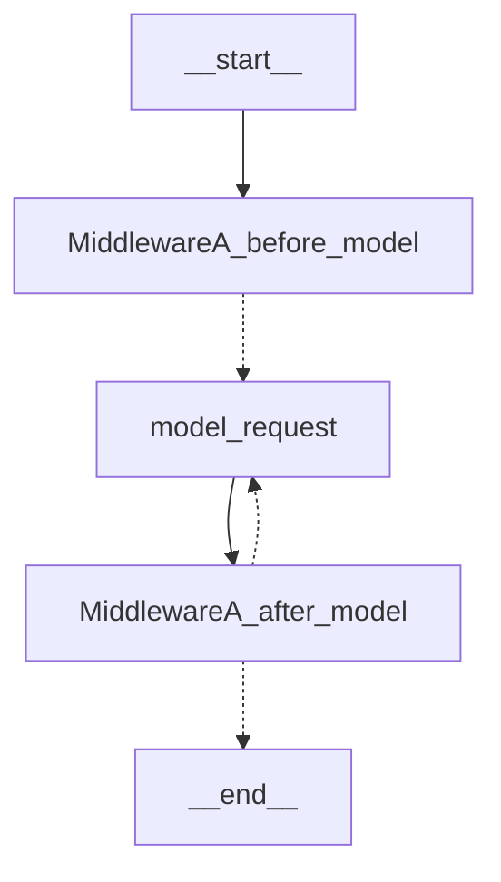

</details>

<details>
<summary>

MiddlewareA beforeAgent: undefined<br/>
MiddlewareA afterAgent: undefined<br/>
MiddlewareA before: undefined<br/>
MiddlewareA after: undefined<br/>
MiddlewareB beforeAgent: undefined<br/>
MiddlewareB afterAgent: undefined<br/>
MiddlewareB before: <code>tools</code><br/>
MiddlewareB after: <code>model</code><br/>
Tools: <code>no</code>

</summary>

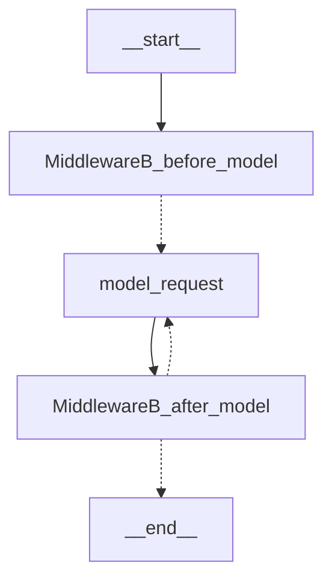

</details>

<details>
<summary>

MiddlewareA beforeAgent: undefined<br/>
MiddlewareA afterAgent: undefined<br/>
MiddlewareA before: <code>model</code><br/>
MiddlewareA after: <code>tools</code><br/>
MiddlewareB beforeAgent: undefined<br/>
MiddlewareB afterAgent: undefined<br/>
MiddlewareB before: undefined<br/>
MiddlewareB after: undefined<br/>
Tools: <code>no</code>

</summary>


</details>

<details>
<summary>

MiddlewareA beforeAgent: undefined<br/>
MiddlewareA afterAgent: undefined<br/>
MiddlewareA before: <code>end</code><br/>
MiddlewareA after: undefined<br/>
MiddlewareB beforeAgent: undefined<br/>
MiddlewareB afterAgent: undefined<br/>
MiddlewareB before: <code>tools</code><br/>
MiddlewareB after: undefined<br/>
Tools: <code>no</code>

</summary>

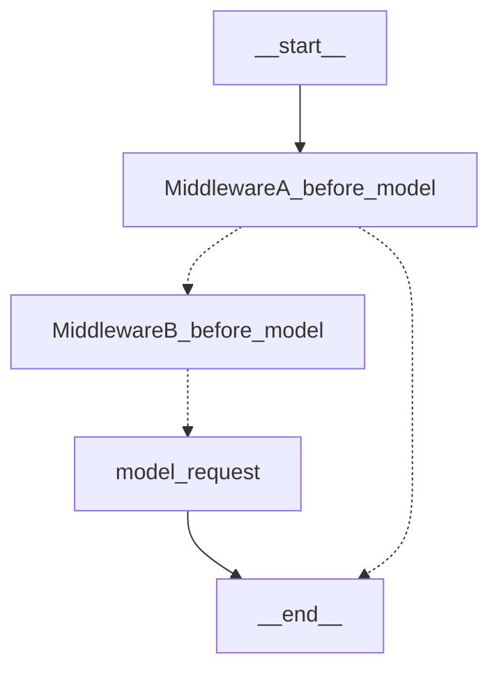

</details>

<details>
<summary>

MiddlewareA beforeAgent: undefined<br/>
MiddlewareA afterAgent: undefined<br/>
MiddlewareA before: <code>tools</code><br/>
MiddlewareA after: <code>end</code><br/>
MiddlewareB beforeAgent: undefined<br/>
MiddlewareB afterAgent: undefined<br/>
MiddlewareB before: <code>model</code><br/>
MiddlewareB after: undefined<br/>
Tools: <code>no</code>

</summary>

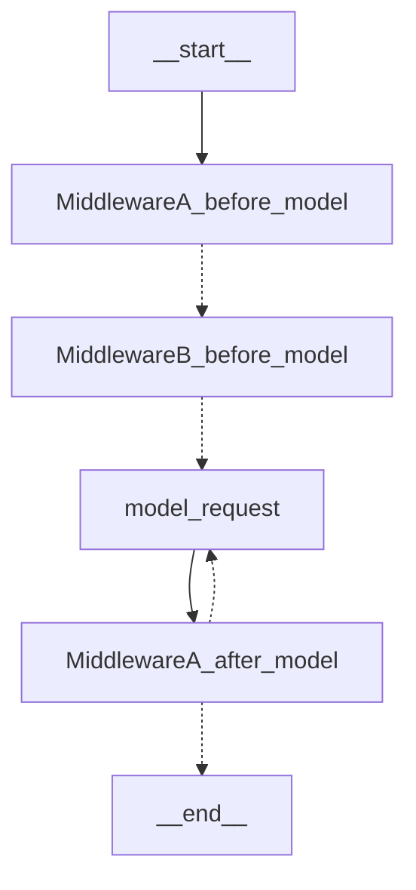

</details>

<details>
<summary>

MiddlewareA beforeAgent: undefined<br/>
MiddlewareA afterAgent: undefined<br/>
MiddlewareA before: undefined<br/>
MiddlewareA after: <code>end</code><br/>
MiddlewareB beforeAgent: undefined<br/>
MiddlewareB afterAgent: undefined<br/>
MiddlewareB before: undefined<br/>
MiddlewareB after: <code>tools</code><br/>
Tools: <code>no</code>

</summary>


</details>

<details>
<summary>

MiddlewareA beforeAgent: undefined<br/>
MiddlewareA afterAgent: undefined<br/>
MiddlewareA before: <code>tools</code>, <code>model</code><br/>
MiddlewareA after: undefined<br/>
MiddlewareB beforeAgent: undefined<br/>
MiddlewareB afterAgent: undefined<br/>
MiddlewareB before: undefined<br/>
MiddlewareB after: undefined<br/>
Tools: <code>no</code>

</summary>


</details>

<details>
<summary>

MiddlewareA beforeAgent: undefined<br/>
MiddlewareA afterAgent: undefined<br/>
MiddlewareA before: undefined<br/>
MiddlewareA after: <code>tools</code>, <code>model</code><br/>
MiddlewareB beforeAgent: undefined<br/>
MiddlewareB afterAgent: undefined<br/>
MiddlewareB before: undefined<br/>
MiddlewareB after: undefined<br/>
Tools: <code>no</code>

</summary>


</details>

<details>
<summary>

MiddlewareA beforeAgent: undefined<br/>
MiddlewareA afterAgent: undefined<br/>
MiddlewareA before: <code>tools</code>, <code>end</code><br/>
MiddlewareA after: undefined<br/>
MiddlewareB beforeAgent: undefined<br/>
MiddlewareB afterAgent: undefined<br/>
MiddlewareB before: <code>model</code><br/>
MiddlewareB after: undefined<br/>
Tools: <code>no</code>

</summary>

```mermaid
graph TD;
	__start__ --> MiddlewareA_before_model;
	model_request --> __end__;
	MiddlewareA_before_model -.-> MiddlewareB_before_model;
	MiddlewareA_before_model -.-> __end__;
	MiddlewareB_before_model -.-> model_request;

```

</details>

<details>
<summary>

MiddlewareA beforeAgent: undefined<br/>
MiddlewareA afterAgent: undefined<br/>
MiddlewareA before: <code>model</code>, <code>end</code><br/>
MiddlewareA after: undefined<br/>
MiddlewareB beforeAgent: undefined<br/>
MiddlewareB afterAgent: undefined<br/>
MiddlewareB before: <code>tools</code><br/>
MiddlewareB after: undefined<br/>
Tools: <code>no</code>

</summary>

```mermaid
graph TD;
	__start__ --> MiddlewareA_before_model;
	model_request --> __end__;
	MiddlewareA_before_model -.-> MiddlewareB_before_model;
	MiddlewareA_before_model -.-> model_request;
	MiddlewareA_before_model -.-> __end__;
	MiddlewareB_before_model -.-> model_request;

```

</details>

<details>
<summary>

MiddlewareA beforeAgent: undefined<br/>
MiddlewareA afterAgent: undefined<br/>
MiddlewareA before: <code>tools</code>, <code>model</code><br/>
MiddlewareA after: <code>end</code><br/>
MiddlewareB beforeAgent: undefined<br/>
MiddlewareB afterAgent: undefined<br/>
MiddlewareB before: <code>tools</code><br/>
MiddlewareB after: <code>model</code><br/>
Tools: <code>no</code>

</summary>

```mermaid
graph TD;
	__start__ --> MiddlewareA_before_model;
	model_request --> MiddlewareB_after_model;
	MiddlewareA_before_model -.-> MiddlewareB_before_model;
	MiddlewareA_before_model -.-> model_request;
	MiddlewareB_before_model -.-> model_request;
	MiddlewareB_after_model -.-> MiddlewareA_after_model;
	MiddlewareB_after_model -.-> model_request;
	MiddlewareA_after_model -.-> model_request;
	MiddlewareA_after_model -.-> __end__;

```

</details>

<details>
<summary>

MiddlewareA beforeAgent: undefined<br/>
MiddlewareA afterAgent: undefined<br/>
MiddlewareA before: <code>tools</code><br/>
MiddlewareA after: <code>model</code>, <code>end</code><br/>
MiddlewareB beforeAgent: undefined<br/>
MiddlewareB afterAgent: undefined<br/>
MiddlewareB before: <code>model</code><br/>
MiddlewareB after: <code>tools</code><br/>
Tools: <code>no</code>

</summary>

```mermaid
graph TD;
	__start__ --> MiddlewareA_before_model;
	model_request --> MiddlewareB_after_model;
	MiddlewareA_before_model -.-> MiddlewareB_before_model;
	MiddlewareB_before_model -.-> model_request;
	MiddlewareB_after_model -.-> MiddlewareA_after_model;
	MiddlewareA_after_model -.-> model_request;
	MiddlewareA_after_model -.-> __end__;

```

</details>

<details>
<summary>

MiddlewareA beforeAgent: undefined<br/>
MiddlewareA afterAgent: undefined<br/>
MiddlewareA before: <code>tools</code>, <code>model</code>, <code>end</code><br/>
MiddlewareA after: undefined<br/>
MiddlewareB beforeAgent: undefined<br/>
MiddlewareB afterAgent: undefined<br/>
MiddlewareB before: undefined<br/>
MiddlewareB after: <code>tools</code>, <code>model</code>, <code>end</code><br/>
Tools: <code>no</code>

</summary>

```mermaid
graph TD;
	__start__ --> MiddlewareA_before_model;
	model_request --> MiddlewareB_after_model;
	MiddlewareA_before_model -.-> model_request;
	MiddlewareA_before_model -.-> __end__;
	MiddlewareB_after_model -.-> model_request;
	MiddlewareB_after_model -.-> __end__;

```

</details>

<details>
<summary>

MiddlewareA beforeAgent: undefined<br/>
MiddlewareA afterAgent: undefined<br/>
MiddlewareA before: <code>end</code><br/>
MiddlewareA after: <code>tools</code><br/>
MiddlewareB beforeAgent: undefined<br/>
MiddlewareB afterAgent: undefined<br/>
MiddlewareB before: <code>end</code><br/>
MiddlewareB after: <code>model</code><br/>
Tools: <code>no</code>

</summary>

```mermaid
graph TD;
	__start__ --> MiddlewareA_before_model;
	model_request --> MiddlewareB_after_model;
	MiddlewareA_before_model -.-> MiddlewareB_before_model;
	MiddlewareA_before_model -.-> __end__;
	MiddlewareB_before_model -.-> model_request;
	MiddlewareB_before_model -.-> __end__;
	MiddlewareB_after_model -.-> MiddlewareA_after_model;
	MiddlewareB_after_model -.-> model_request;
	MiddlewareA_after_model -.-> model_request;
	MiddlewareA_after_model -.-> __end__;

```

</details>

<details>
<summary>

MiddlewareA beforeAgent: undefined<br/>
MiddlewareA afterAgent: undefined<br/>
MiddlewareA before: <code>tools</code>, <code>model</code>, <code>end</code><br/>
MiddlewareA after: <code>tools</code>, <code>model</code>, <code>end</code><br/>
MiddlewareB beforeAgent: undefined<br/>
MiddlewareB afterAgent: undefined<br/>
MiddlewareB before: <code>tools</code>, <code>model</code>, <code>end</code><br/>
MiddlewareB after: <code>tools</code>, <code>model</code>, <code>end</code><br/>
Tools: <code>no</code>

</summary>

```mermaid
graph TD;
	__start__ --> MiddlewareA_before_model;
	model_request --> MiddlewareB_after_model;
	MiddlewareA_before_model -.-> MiddlewareB_before_model;
	MiddlewareA_before_model -.-> model_request;
	MiddlewareA_before_model -.-> __end__;
	MiddlewareB_before_model -.-> model_request;
	MiddlewareB_before_model -.-> __end__;
	MiddlewareB_after_model -.-> MiddlewareA_after_model;
	MiddlewareB_after_model -.-> model_request;
	MiddlewareB_after_model -.-> __end__;
	MiddlewareA_after_model -.-> model_request;
	MiddlewareA_after_model -.-> __end__;

```

</details>

<details>
<summary>

MiddlewareA beforeAgent: <code>tools</code><br/>
MiddlewareA afterAgent: undefined<br/>
MiddlewareA before: undefined<br/>
MiddlewareA after: undefined<br/>
MiddlewareB beforeAgent: undefined<br/>
MiddlewareB afterAgent: undefined<br/>
MiddlewareB before: undefined<br/>
MiddlewareB after: undefined<br/>
Tools: <code>no</code>

</summary>

```mermaid
graph TD;
	__start__ --> MiddlewareA_before_agent;
	model_request --> __end__;
	MiddlewareA_before_agent -.-> model_request;

```

</details>

<details>
<summary>

MiddlewareA beforeAgent: undefined<br/>
MiddlewareA afterAgent: <code>model</code><br/>
MiddlewareA before: undefined<br/>
MiddlewareA after: undefined<br/>
MiddlewareB beforeAgent: undefined<br/>
MiddlewareB afterAgent: undefined<br/>
MiddlewareB before: undefined<br/>
MiddlewareB after: undefined<br/>
Tools: <code>no</code>

</summary>

```mermaid
graph TD;
	__start__ --> model_request;
	model_request --> MiddlewareA_after_agent;
	MiddlewareA_after_agent -.-> __end__;
	MiddlewareA_after_agent -.-> model_request;

```

</details>

<details>
<summary>

MiddlewareA beforeAgent: <code>tools</code><br/>
MiddlewareA afterAgent: <code>end</code><br/>
MiddlewareA before: <code>model</code><br/>
MiddlewareA after: <code>tools</code><br/>
MiddlewareB beforeAgent: undefined<br/>
MiddlewareB afterAgent: undefined<br/>
MiddlewareB before: undefined<br/>
MiddlewareB after: undefined<br/>
Tools: <code>no</code>

</summary>

```mermaid
graph TD;
	__start__ --> MiddlewareA_before_agent;
	model_request --> MiddlewareA_after_model;
	MiddlewareA_before_agent -.-> MiddlewareA_before_model;
	MiddlewareA_before_model -.-> model_request;
	MiddlewareA_after_model -.-> model_request;
	MiddlewareA_after_model -.-> MiddlewareA_after_agent;
	MiddlewareA_after_agent -.-> __end__;

```

</details>

<details>
<summary>

MiddlewareA beforeAgent: <code>tools</code><br/>
MiddlewareA afterAgent: undefined<br/>
MiddlewareA before: undefined<br/>
MiddlewareA after: undefined<br/>
MiddlewareB beforeAgent: <code>model</code><br/>
MiddlewareB afterAgent: undefined<br/>
MiddlewareB before: undefined<br/>
MiddlewareB after: undefined<br/>
Tools: <code>no</code>

</summary>

```mermaid
graph TD;
	__start__ --> MiddlewareA_before_agent;
	model_request --> __end__;
	MiddlewareA_before_agent -.-> MiddlewareB_before_agent;
	MiddlewareB_before_agent -.-> model_request;

```

</details>

<details>
<summary>

MiddlewareA beforeAgent: undefined<br/>
MiddlewareA afterAgent: <code>tools</code><br/>
MiddlewareA before: undefined<br/>
MiddlewareA after: undefined<br/>
MiddlewareB beforeAgent: undefined<br/>
MiddlewareB afterAgent: <code>model</code><br/>
MiddlewareB before: undefined<br/>
MiddlewareB after: undefined<br/>
Tools: <code>no</code>

</summary>

```mermaid
graph TD;
	__start__ --> model_request;
	model_request --> MiddlewareB_after_agent;
	MiddlewareB_after_agent -.-> MiddlewareA_after_agent;
	MiddlewareB_after_agent -.-> model_request;
	MiddlewareA_after_agent -.-> __end__;

```

</details>

<details>
<summary>

MiddlewareA beforeAgent: <code>tools</code>, <code>model</code>, <code>end</code><br/>
MiddlewareA afterAgent: <code>tools</code>, <code>model</code>, <code>end</code><br/>
MiddlewareA before: <code>tools</code><br/>
MiddlewareA after: <code>model</code><br/>
MiddlewareB beforeAgent: undefined<br/>
MiddlewareB afterAgent: undefined<br/>
MiddlewareB before: undefined<br/>
MiddlewareB after: undefined<br/>
Tools: <code>no</code>

</summary>

```mermaid
graph TD;
	__start__ --> MiddlewareA_before_agent;
	model_request --> MiddlewareA_after_model;
	MiddlewareA_before_agent -.-> MiddlewareA_before_model;
	MiddlewareA_before_agent -.-> model_request;
	MiddlewareA_before_agent -.-> MiddlewareA_after_agent;
	MiddlewareA_before_model -.-> model_request;
	MiddlewareA_after_model -.-> model_request;
	MiddlewareA_after_model -.-> MiddlewareA_after_agent;
	MiddlewareA_after_agent -.-> __end__;
	MiddlewareA_after_agent -.-> model_request;

```

</details>

<details>
<summary>

MiddlewareA beforeAgent: undefined<br/>
MiddlewareA afterAgent: undefined<br/>
MiddlewareA before: undefined<br/>
MiddlewareA after: undefined<br/>
MiddlewareB beforeAgent: undefined<br/>
MiddlewareB afterAgent: undefined<br/>
MiddlewareB before: undefined<br/>
MiddlewareB after: undefined<br/>
Tools: <code>yes</code>

</summary>

```mermaid
graph TD;
	__start__ --> model_request;
	tools --> model_request;
	model_request -.-> tools;
	model_request -.-> __end__;

```

</details>

<details>
<summary>

MiddlewareA beforeAgent: undefined<br/>
MiddlewareA afterAgent: undefined<br/>
MiddlewareA before: empty<br/>
MiddlewareA after: empty<br/>
MiddlewareB beforeAgent: undefined<br/>
MiddlewareB afterAgent: undefined<br/>
MiddlewareB before: empty<br/>
MiddlewareB after: empty<br/>
Tools: <code>yes</code>

</summary>

```mermaid
graph TD;
	MiddlewareA_before_model --> MiddlewareB_before_model;
	MiddlewareB_after_model --> MiddlewareA_after_model;
	MiddlewareB_before_model --> model_request;
	__start__ --> MiddlewareA_before_model;
	model_request --> MiddlewareB_after_model;
	tools --> MiddlewareA_before_model;
	MiddlewareA_after_model -.-> tools;
	MiddlewareA_after_model -.-> model_request;
	MiddlewareA_after_model -.-> __end__;

```

</details>

<details>
<summary>

MiddlewareA beforeAgent: undefined<br/>
MiddlewareA afterAgent: undefined<br/>
MiddlewareA before: <code>tools</code><br/>
MiddlewareA after: undefined<br/>
MiddlewareB beforeAgent: undefined<br/>
MiddlewareB afterAgent: undefined<br/>
MiddlewareB before: undefined<br/>
MiddlewareB after: undefined<br/>
Tools: <code>yes</code>

</summary>

```mermaid
graph TD;
	__start__ --> MiddlewareA_before_model;
	tools --> MiddlewareA_before_model;
	MiddlewareA_before_model -.-> model_request;
	MiddlewareA_before_model -.-> tools;
	model_request -.-> tools;
	model_request -.-> __end__;

```

</details>

<details>
<summary>

MiddlewareA beforeAgent: undefined<br/>
MiddlewareA afterAgent: undefined<br/>
MiddlewareA before: undefined<br/>
MiddlewareA after: <code>tools</code><br/>
MiddlewareB beforeAgent: undefined<br/>
MiddlewareB afterAgent: undefined<br/>
MiddlewareB before: undefined<br/>
MiddlewareB after: undefined<br/>
Tools: <code>yes</code>

</summary>

```mermaid
graph TD;
	__start__ --> model_request;
	model_request --> MiddlewareA_after_model;
	tools --> model_request;
	MiddlewareA_after_model -.-> tools;
	MiddlewareA_after_model -.-> model_request;
	MiddlewareA_after_model -.-> __end__;

```

</details>

<details>
<summary>

MiddlewareA beforeAgent: undefined<br/>
MiddlewareA afterAgent: undefined<br/>
MiddlewareA before: <code>model</code><br/>
MiddlewareA after: undefined<br/>
MiddlewareB beforeAgent: undefined<br/>
MiddlewareB afterAgent: undefined<br/>
MiddlewareB before: undefined<br/>
MiddlewareB after: undefined<br/>
Tools: <code>yes</code>

</summary>

```mermaid
graph TD;
	__start__ --> MiddlewareA_before_model;
	tools --> MiddlewareA_before_model;
	MiddlewareA_before_model -.-> model_request;
	model_request -.-> tools;
	model_request -.-> __end__;

```

</details>

<details>
<summary>

MiddlewareA beforeAgent: undefined<br/>
MiddlewareA afterAgent: undefined<br/>
MiddlewareA before: undefined<br/>
MiddlewareA after: <code>model</code><br/>
MiddlewareB beforeAgent: undefined<br/>
MiddlewareB afterAgent: undefined<br/>
MiddlewareB before: undefined<br/>
MiddlewareB after: undefined<br/>
Tools: <code>yes</code>

</summary>

```mermaid
graph TD;
	__start__ --> model_request;
	model_request --> MiddlewareA_after_model;
	tools --> model_request;
	MiddlewareA_after_model -.-> tools;
	MiddlewareA_after_model -.-> model_request;
	MiddlewareA_after_model -.-> __end__;

```

</details>

<details>
<summary>

MiddlewareA beforeAgent: undefined<br/>
MiddlewareA afterAgent: undefined<br/>
MiddlewareA before: <code>end</code><br/>
MiddlewareA after: undefined<br/>
MiddlewareB beforeAgent: undefined<br/>
MiddlewareB afterAgent: undefined<br/>
MiddlewareB before: undefined<br/>
MiddlewareB after: undefined<br/>
Tools: <code>yes</code>

</summary>

```mermaid
graph TD;
	__start__ --> MiddlewareA_before_model;
	tools --> MiddlewareA_before_model;
	MiddlewareA_before_model -.-> model_request;
	MiddlewareA_before_model -.-> __end__;
	model_request -.-> tools;
	model_request -.-> __end__;

```

</details>

<details>
<summary>

MiddlewareA beforeAgent: undefined<br/>
MiddlewareA afterAgent: undefined<br/>
MiddlewareA before: undefined<br/>
MiddlewareA after: <code>end</code><br/>
MiddlewareB beforeAgent: undefined<br/>
MiddlewareB afterAgent: undefined<br/>
MiddlewareB before: undefined<br/>
MiddlewareB after: undefined<br/>
Tools: <code>yes</code>

</summary>

```mermaid
graph TD;
	__start__ --> model_request;
	model_request --> MiddlewareA_after_model;
	tools --> model_request;
	MiddlewareA_after_model -.-> tools;
	MiddlewareA_after_model -.-> model_request;
	MiddlewareA_after_model -.-> __end__;

```

</details>

<details>
<summary>

MiddlewareA beforeAgent: undefined<br/>
MiddlewareA afterAgent: undefined<br/>
MiddlewareA before: <code>tools</code><br/>
MiddlewareA after: undefined<br/>
MiddlewareB beforeAgent: undefined<br/>
MiddlewareB afterAgent: undefined<br/>
MiddlewareB before: <code>model</code><br/>
MiddlewareB after: undefined<br/>
Tools: <code>yes</code>

</summary>

```mermaid
graph TD;
	__start__ --> MiddlewareA_before_model;
	tools --> MiddlewareA_before_model;
	MiddlewareA_before_model -.-> MiddlewareB_before_model;
	MiddlewareA_before_model -.-> tools;
	MiddlewareB_before_model -.-> model_request;
	model_request -.-> tools;
	model_request -.-> __end__;

```

</details>

<details>
<summary>

MiddlewareA beforeAgent: undefined<br/>
MiddlewareA afterAgent: undefined<br/>
MiddlewareA before: <code>model</code><br/>
MiddlewareA after: undefined<br/>
MiddlewareB beforeAgent: undefined<br/>
MiddlewareB afterAgent: undefined<br/>
MiddlewareB before: <code>tools</code><br/>
MiddlewareB after: undefined<br/>
Tools: <code>yes</code>

</summary>

```mermaid
graph TD;
	__start__ --> MiddlewareA_before_model;
	tools --> MiddlewareA_before_model;
	MiddlewareA_before_model -.-> MiddlewareB_before_model;
	MiddlewareA_before_model -.-> model_request;
	MiddlewareB_before_model -.-> model_request;
	MiddlewareB_before_model -.-> tools;
	model_request -.-> tools;
	model_request -.-> __end__;

```

</details>

<details>
<summary>

MiddlewareA beforeAgent: undefined<br/>
MiddlewareA afterAgent: undefined<br/>
MiddlewareA before: undefined<br/>
MiddlewareA after: <code>tools</code><br/>
MiddlewareB beforeAgent: undefined<br/>
MiddlewareB afterAgent: undefined<br/>
MiddlewareB before: undefined<br/>
MiddlewareB after: <code>model</code><br/>
Tools: <code>yes</code>

</summary>

```mermaid
graph TD;
	__start__ --> model_request;
	model_request --> MiddlewareB_after_model;
	tools --> model_request;
	MiddlewareB_after_model -.-> MiddlewareA_after_model;
	MiddlewareB_after_model -.-> model_request;
	MiddlewareA_after_model -.-> tools;
	MiddlewareA_after_model -.-> model_request;
	MiddlewareA_after_model -.-> __end__;

```

</details>

<details>
<summary>

MiddlewareA beforeAgent: undefined<br/>
MiddlewareA afterAgent: undefined<br/>
MiddlewareA before: undefined<br/>
MiddlewareA after: <code>model</code><br/>
MiddlewareB beforeAgent: undefined<br/>
MiddlewareB afterAgent: undefined<br/>
MiddlewareB before: undefined<br/>
MiddlewareB after: <code>tools</code><br/>
Tools: <code>yes</code>

</summary>

```mermaid
graph TD;
	__start__ --> model_request;
	model_request --> MiddlewareB_after_model;
	tools --> model_request;
	MiddlewareB_after_model -.-> MiddlewareA_after_model;
	MiddlewareB_after_model -.-> tools;
	MiddlewareA_after_model -.-> tools;
	MiddlewareA_after_model -.-> model_request;
	MiddlewareA_after_model -.-> __end__;

```

</details>

<details>
<summary>

MiddlewareA beforeAgent: undefined<br/>
MiddlewareA afterAgent: undefined<br/>
MiddlewareA before: <code>tools</code><br/>
MiddlewareA after: <code>model</code><br/>
MiddlewareB beforeAgent: undefined<br/>
MiddlewareB afterAgent: undefined<br/>
MiddlewareB before: undefined<br/>
MiddlewareB after: undefined<br/>
Tools: <code>yes</code>

</summary>

```mermaid
graph TD;
	__start__ --> MiddlewareA_before_model;
	model_request --> MiddlewareA_after_model;
	tools --> MiddlewareA_before_model;
	MiddlewareA_before_model -.-> model_request;
	MiddlewareA_before_model -.-> tools;
	MiddlewareA_after_model -.-> tools;
	MiddlewareA_after_model -.-> model_request;
	MiddlewareA_after_model -.-> __end__;

```

</details>

<details>
<summary>

MiddlewareA beforeAgent: undefined<br/>
MiddlewareA afterAgent: undefined<br/>
MiddlewareA before: undefined<br/>
MiddlewareA after: undefined<br/>
MiddlewareB beforeAgent: undefined<br/>
MiddlewareB afterAgent: undefined<br/>
MiddlewareB before: <code>tools</code><br/>
MiddlewareB after: <code>model</code><br/>
Tools: <code>yes</code>

</summary>

```mermaid
graph TD;
	__start__ --> MiddlewareB_before_model;
	model_request --> MiddlewareB_after_model;
	tools --> MiddlewareB_before_model;
	MiddlewareB_before_model -.-> model_request;
	MiddlewareB_before_model -.-> tools;
	MiddlewareB_after_model -.-> tools;
	MiddlewareB_after_model -.-> model_request;
	MiddlewareB_after_model -.-> __end__;

```

</details>

<details>
<summary>

MiddlewareA beforeAgent: undefined<br/>
MiddlewareA afterAgent: undefined<br/>
MiddlewareA before: <code>model</code><br/>
MiddlewareA after: <code>tools</code><br/>
MiddlewareB beforeAgent: undefined<br/>
MiddlewareB afterAgent: undefined<br/>
MiddlewareB before: undefined<br/>
MiddlewareB after: undefined<br/>
Tools: <code>yes</code>

</summary>

```mermaid
graph TD;
	__start__ --> MiddlewareA_before_model;
	model_request --> MiddlewareA_after_model;
	tools --> MiddlewareA_before_model;
	MiddlewareA_before_model -.-> model_request;
	MiddlewareA_after_model -.-> tools;
	MiddlewareA_after_model -.-> model_request;
	MiddlewareA_after_model -.-> __end__;

```

</details>

<details>
<summary>

MiddlewareA beforeAgent: undefined<br/>
MiddlewareA afterAgent: undefined<br/>
MiddlewareA before: <code>end</code><br/>
MiddlewareA after: undefined<br/>
MiddlewareB beforeAgent: undefined<br/>
MiddlewareB afterAgent: undefined<br/>
MiddlewareB before: <code>tools</code><br/>
MiddlewareB after: undefined<br/>
Tools: <code>yes</code>

</summary>

```mermaid
graph TD;
	__start__ --> MiddlewareA_before_model;
	tools --> MiddlewareA_before_model;
	MiddlewareA_before_model -.-> MiddlewareB_before_model;
	MiddlewareA_before_model -.-> __end__;
	MiddlewareB_before_model -.-> model_request;
	MiddlewareB_before_model -.-> tools;
	model_request -.-> tools;
	model_request -.-> __end__;

```

</details>

<details>
<summary>

MiddlewareA beforeAgent: undefined<br/>
MiddlewareA afterAgent: undefined<br/>
MiddlewareA before: <code>tools</code><br/>
MiddlewareA after: <code>end</code><br/>
MiddlewareB beforeAgent: undefined<br/>
MiddlewareB afterAgent: undefined<br/>
MiddlewareB before: <code>model</code><br/>
MiddlewareB after: undefined<br/>
Tools: <code>yes</code>

</summary>

```mermaid
graph TD;
	__start__ --> MiddlewareA_before_model;
	model_request --> MiddlewareA_after_model;
	tools --> MiddlewareA_before_model;
	MiddlewareA_before_model -.-> MiddlewareB_before_model;
	MiddlewareA_before_model -.-> tools;
	MiddlewareB_before_model -.-> model_request;
	MiddlewareA_after_model -.-> tools;
	MiddlewareA_after_model -.-> model_request;
	MiddlewareA_after_model -.-> __end__;

```

</details>

<details>
<summary>

MiddlewareA beforeAgent: undefined<br/>
MiddlewareA afterAgent: undefined<br/>
MiddlewareA before: undefined<br/>
MiddlewareA after: <code>end</code><br/>
MiddlewareB beforeAgent: undefined<br/>
MiddlewareB afterAgent: undefined<br/>
MiddlewareB before: undefined<br/>
MiddlewareB after: <code>tools</code><br/>
Tools: <code>yes</code>

</summary>

```mermaid
graph TD;
	__start__ --> model_request;
	model_request --> MiddlewareB_after_model;
	tools --> model_request;
	MiddlewareB_after_model -.-> MiddlewareA_after_model;
	MiddlewareB_after_model -.-> tools;
	MiddlewareA_after_model -.-> tools;
	MiddlewareA_after_model -.-> model_request;
	MiddlewareA_after_model -.-> __end__;

```

</details>

<details>
<summary>

MiddlewareA beforeAgent: undefined<br/>
MiddlewareA afterAgent: undefined<br/>
MiddlewareA before: <code>tools</code>, <code>model</code><br/>
MiddlewareA after: undefined<br/>
MiddlewareB beforeAgent: undefined<br/>
MiddlewareB afterAgent: undefined<br/>
MiddlewareB before: undefined<br/>
MiddlewareB after: undefined<br/>
Tools: <code>yes</code>

</summary>

```mermaid
graph TD;
	__start__ --> MiddlewareA_before_model;
	tools --> MiddlewareA_before_model;
	MiddlewareA_before_model -.-> model_request;
	MiddlewareA_before_model -.-> tools;
	model_request -.-> tools;
	model_request -.-> __end__;

```

</details>

<details>
<summary>

MiddlewareA beforeAgent: undefined<br/>
MiddlewareA afterAgent: undefined<br/>
MiddlewareA before: undefined<br/>
MiddlewareA after: <code>tools</code>, <code>model</code><br/>
MiddlewareB beforeAgent: undefined<br/>
MiddlewareB afterAgent: undefined<br/>
MiddlewareB before: undefined<br/>
MiddlewareB after: undefined<br/>
Tools: <code>yes</code>

</summary>

```mermaid
graph TD;
	__start__ --> model_request;
	model_request --> MiddlewareA_after_model;
	tools --> model_request;
	MiddlewareA_after_model -.-> tools;
	MiddlewareA_after_model -.-> model_request;
	MiddlewareA_after_model -.-> __end__;

```

</details>

<details>
<summary>

MiddlewareA beforeAgent: undefined<br/>
MiddlewareA afterAgent: undefined<br/>
MiddlewareA before: <code>tools</code>, <code>end</code><br/>
MiddlewareA after: undefined<br/>
MiddlewareB beforeAgent: undefined<br/>
MiddlewareB afterAgent: undefined<br/>
MiddlewareB before: <code>model</code><br/>
MiddlewareB after: undefined<br/>
Tools: <code>yes</code>

</summary>

```mermaid
graph TD;
	__start__ --> MiddlewareA_before_model;
	tools --> MiddlewareA_before_model;
	MiddlewareA_before_model -.-> MiddlewareB_before_model;
	MiddlewareA_before_model -.-> tools;
	MiddlewareA_before_model -.-> __end__;
	MiddlewareB_before_model -.-> model_request;
	model_request -.-> tools;
	model_request -.-> __end__;

```

</details>

<details>
<summary>

MiddlewareA beforeAgent: undefined<br/>
MiddlewareA afterAgent: undefined<br/>
MiddlewareA before: <code>model</code>, <code>end</code><br/>
MiddlewareA after: undefined<br/>
MiddlewareB beforeAgent: undefined<br/>
MiddlewareB afterAgent: undefined<br/>
MiddlewareB before: <code>tools</code><br/>
MiddlewareB after: undefined<br/>
Tools: <code>yes</code>

</summary>

```mermaid
graph TD;
	__start__ --> MiddlewareA_before_model;
	tools --> MiddlewareA_before_model;
	MiddlewareA_before_model -.-> MiddlewareB_before_model;
	MiddlewareA_before_model -.-> model_request;
	MiddlewareA_before_model -.-> __end__;
	MiddlewareB_before_model -.-> model_request;
	MiddlewareB_before_model -.-> tools;
	model_request -.-> tools;
	model_request -.-> __end__;

```

</details>

<details>
<summary>

MiddlewareA beforeAgent: undefined<br/>
MiddlewareA afterAgent: undefined<br/>
MiddlewareA before: <code>tools</code>, <code>model</code><br/>
MiddlewareA after: <code>end</code><br/>
MiddlewareB beforeAgent: undefined<br/>
MiddlewareB afterAgent: undefined<br/>
MiddlewareB before: <code>tools</code><br/>
MiddlewareB after: <code>model</code><br/>
Tools: <code>yes</code>

</summary>

```mermaid
graph TD;
	__start__ --> MiddlewareA_before_model;
	model_request --> MiddlewareB_after_model;
	tools --> MiddlewareA_before_model;
	MiddlewareA_before_model -.-> MiddlewareB_before_model;
	MiddlewareA_before_model -.-> tools;
	MiddlewareA_before_model -.-> model_request;
	MiddlewareB_before_model -.-> model_request;
	MiddlewareB_before_model -.-> tools;
	MiddlewareB_after_model -.-> MiddlewareA_after_model;
	MiddlewareB_after_model -.-> model_request;
	MiddlewareA_after_model -.-> tools;
	MiddlewareA_after_model -.-> model_request;
	MiddlewareA_after_model -.-> __end__;

```

</details>

<details>
<summary>

MiddlewareA beforeAgent: undefined<br/>
MiddlewareA afterAgent: undefined<br/>
MiddlewareA before: <code>tools</code><br/>
MiddlewareA after: <code>model</code>, <code>end</code><br/>
MiddlewareB beforeAgent: undefined<br/>
MiddlewareB afterAgent: undefined<br/>
MiddlewareB before: <code>model</code><br/>
MiddlewareB after: <code>tools</code><br/>
Tools: <code>yes</code>

</summary>

```mermaid
graph TD;
	__start__ --> MiddlewareA_before_model;
	model_request --> MiddlewareB_after_model;
	tools --> MiddlewareA_before_model;
	MiddlewareA_before_model -.-> MiddlewareB_before_model;
	MiddlewareA_before_model -.-> tools;
	MiddlewareB_before_model -.-> model_request;
	MiddlewareB_after_model -.-> MiddlewareA_after_model;
	MiddlewareB_after_model -.-> tools;
	MiddlewareA_after_model -.-> tools;
	MiddlewareA_after_model -.-> model_request;
	MiddlewareA_after_model -.-> __end__;

```

</details>

<details>
<summary>

MiddlewareA beforeAgent: undefined<br/>
MiddlewareA afterAgent: undefined<br/>
MiddlewareA before: <code>tools</code>, <code>model</code>, <code>end</code><br/>
MiddlewareA after: undefined<br/>
MiddlewareB beforeAgent: undefined<br/>
MiddlewareB afterAgent: undefined<br/>
MiddlewareB before: undefined<br/>
MiddlewareB after: <code>tools</code>, <code>model</code>, <code>end</code><br/>
Tools: <code>yes</code>

</summary>

```mermaid
graph TD;
	__start__ --> MiddlewareA_before_model;
	model_request --> MiddlewareB_after_model;
	tools --> MiddlewareA_before_model;
	MiddlewareA_before_model -.-> model_request;
	MiddlewareA_before_model -.-> tools;
	MiddlewareA_before_model -.-> __end__;
	MiddlewareB_after_model -.-> tools;
	MiddlewareB_after_model -.-> model_request;
	MiddlewareB_after_model -.-> __end__;

```

</details>

<details>
<summary>

MiddlewareA beforeAgent: undefined<br/>
MiddlewareA afterAgent: undefined<br/>
MiddlewareA before: <code>end</code><br/>
MiddlewareA after: <code>tools</code><br/>
MiddlewareB beforeAgent: undefined<br/>
MiddlewareB afterAgent: undefined<br/>
MiddlewareB before: <code>end</code><br/>
MiddlewareB after: <code>model</code><br/>
Tools: <code>yes</code>

</summary>

```mermaid
graph TD;
	__start__ --> MiddlewareA_before_model;
	model_request --> MiddlewareB_after_model;
	tools --> MiddlewareA_before_model;
	MiddlewareA_before_model -.-> MiddlewareB_before_model;
	MiddlewareA_before_model -.-> __end__;
	MiddlewareB_before_model -.-> model_request;
	MiddlewareB_before_model -.-> __end__;
	MiddlewareB_after_model -.-> MiddlewareA_after_model;
	MiddlewareB_after_model -.-> model_request;
	MiddlewareA_after_model -.-> tools;
	MiddlewareA_after_model -.-> model_request;
	MiddlewareA_after_model -.-> __end__;

```

</details>

<details>
<summary>

MiddlewareA beforeAgent: undefined<br/>
MiddlewareA afterAgent: undefined<br/>
MiddlewareA before: <code>tools</code>, <code>model</code>, <code>end</code><br/>
MiddlewareA after: <code>tools</code>, <code>model</code>, <code>end</code><br/>
MiddlewareB beforeAgent: undefined<br/>
MiddlewareB afterAgent: undefined<br/>
MiddlewareB before: <code>tools</code>, <code>model</code>, <code>end</code><br/>
MiddlewareB after: <code>tools</code>, <code>model</code>, <code>end</code><br/>
Tools: <code>yes</code>

</summary>

```mermaid
graph TD;
	__start__ --> MiddlewareA_before_model;
	model_request --> MiddlewareB_after_model;
	tools --> MiddlewareA_before_model;
	MiddlewareA_before_model -.-> MiddlewareB_before_model;
	MiddlewareA_before_model -.-> tools;
	MiddlewareA_before_model -.-> model_request;
	MiddlewareA_before_model -.-> __end__;
	MiddlewareB_before_model -.-> model_request;
	MiddlewareB_before_model -.-> tools;
	MiddlewareB_before_model -.-> __end__;
	MiddlewareB_after_model -.-> MiddlewareA_after_model;
	MiddlewareB_after_model -.-> tools;
	MiddlewareB_after_model -.-> model_request;
	MiddlewareB_after_model -.-> __end__;
	MiddlewareA_after_model -.-> tools;
	MiddlewareA_after_model -.-> model_request;
	MiddlewareA_after_model -.-> __end__;

```

</details>

<details>
<summary>

MiddlewareA beforeAgent: <code>tools</code><br/>
MiddlewareA afterAgent: undefined<br/>
MiddlewareA before: undefined<br/>
MiddlewareA after: undefined<br/>
MiddlewareB beforeAgent: undefined<br/>
MiddlewareB afterAgent: undefined<br/>
MiddlewareB before: undefined<br/>
MiddlewareB after: undefined<br/>
Tools: <code>yes</code>

</summary>

```mermaid
graph TD;
	__start__ --> MiddlewareA_before_agent;
	tools --> model_request;
	MiddlewareA_before_agent -.-> model_request;
	MiddlewareA_before_agent -.-> tools;
	model_request -.-> tools;
	model_request -.-> __end__;

```

</details>

<details>
<summary>

MiddlewareA beforeAgent: undefined<br/>
MiddlewareA afterAgent: <code>model</code><br/>
MiddlewareA before: undefined<br/>
MiddlewareA after: undefined<br/>
MiddlewareB beforeAgent: undefined<br/>
MiddlewareB afterAgent: undefined<br/>
MiddlewareB before: undefined<br/>
MiddlewareB after: undefined<br/>
Tools: <code>yes</code>

</summary>

```mermaid
graph TD;
	__start__ --> model_request;
	tools --> model_request;
	model_request -.-> tools;
	model_request -.-> MiddlewareA_after_agent;
	MiddlewareA_after_agent -.-> __end__;
	MiddlewareA_after_agent -.-> model_request;

```

</details>

<details>
<summary>

MiddlewareA beforeAgent: <code>tools</code><br/>
MiddlewareA afterAgent: <code>end</code><br/>
MiddlewareA before: <code>model</code><br/>
MiddlewareA after: <code>tools</code><br/>
MiddlewareB beforeAgent: undefined<br/>
MiddlewareB afterAgent: undefined<br/>
MiddlewareB before: undefined<br/>
MiddlewareB after: undefined<br/>
Tools: <code>yes</code>

</summary>

```mermaid
graph TD;
	__start__ --> MiddlewareA_before_agent;
	model_request --> MiddlewareA_after_model;
	tools --> MiddlewareA_before_model;
	MiddlewareA_before_agent -.-> MiddlewareA_before_model;
	MiddlewareA_before_agent -.-> tools;
	MiddlewareA_before_model -.-> model_request;
	MiddlewareA_after_model -.-> tools;
	MiddlewareA_after_model -.-> model_request;
	MiddlewareA_after_model -.-> MiddlewareA_after_agent;
	MiddlewareA_after_agent -.-> __end__;

```

</details>

<details>
<summary>

MiddlewareA beforeAgent: <code>tools</code><br/>
MiddlewareA afterAgent: undefined<br/>
MiddlewareA before: undefined<br/>
MiddlewareA after: undefined<br/>
MiddlewareB beforeAgent: <code>model</code><br/>
MiddlewareB afterAgent: undefined<br/>
MiddlewareB before: undefined<br/>
MiddlewareB after: undefined<br/>
Tools: <code>yes</code>

</summary>

```mermaid
graph TD;
	__start__ --> MiddlewareA_before_agent;
	tools --> model_request;
	MiddlewareA_before_agent -.-> MiddlewareB_before_agent;
	MiddlewareA_before_agent -.-> tools;
	MiddlewareB_before_agent -.-> model_request;
	model_request -.-> tools;
	model_request -.-> __end__;

```

</details>

<details>
<summary>

MiddlewareA beforeAgent: undefined<br/>
MiddlewareA afterAgent: <code>tools</code><br/>
MiddlewareA before: undefined<br/>
MiddlewareA after: undefined<br/>
MiddlewareB beforeAgent: undefined<br/>
MiddlewareB afterAgent: <code>model</code><br/>
MiddlewareB before: undefined<br/>
MiddlewareB after: undefined<br/>
Tools: <code>yes</code>

</summary>

```mermaid
graph TD;
	__start__ --> model_request;
	tools --> model_request;
	model_request -.-> tools;
	model_request -.-> MiddlewareB_after_agent;
	MiddlewareB_after_agent -.-> MiddlewareA_after_agent;
	MiddlewareB_after_agent -.-> model_request;
	MiddlewareA_after_agent -.-> __end__;
	MiddlewareA_after_agent -.-> tools;

```

</details>

<details>
<summary>

MiddlewareA beforeAgent: <code>tools</code>, <code>model</code>, <code>end</code><br/>
MiddlewareA afterAgent: <code>tools</code>, <code>model</code>, <code>end</code><br/>
MiddlewareA before: <code>tools</code><br/>
MiddlewareA after: <code>model</code><br/>
MiddlewareB beforeAgent: undefined<br/>
MiddlewareB afterAgent: undefined<br/>
MiddlewareB before: undefined<br/>
MiddlewareB after: undefined<br/>
Tools: <code>yes</code>

</summary>

```mermaid
graph TD;
	__start__ --> MiddlewareA_before_agent;
	model_request --> MiddlewareA_after_model;
	tools --> MiddlewareA_before_model;
	MiddlewareA_before_agent -.-> MiddlewareA_before_model;
	MiddlewareA_before_agent -.-> tools;
	MiddlewareA_before_agent -.-> model_request;
	MiddlewareA_before_agent -.-> MiddlewareA_after_agent;
	MiddlewareA_before_model -.-> model_request;
	MiddlewareA_before_model -.-> tools;
	MiddlewareA_after_model -.-> tools;
	MiddlewareA_after_model -.-> model_request;
	MiddlewareA_after_model -.-> MiddlewareA_after_agent;
	MiddlewareA_after_agent -.-> __end__;
	MiddlewareA_after_agent -.-> tools;
	MiddlewareA_after_agent -.-> model_request;

```

</details>